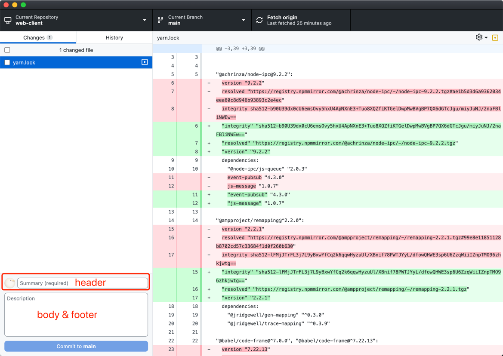
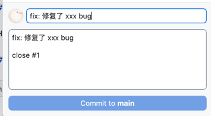

# Git Commit 规范建议

作者：`Github Copilot`

为了方便大家更好的使用 Git，我们建议大家在使用 Git 的时候，遵循以下的 Commit message 格式，这样可以使得我们的 Commit message 更加规范化，方便后续的维护。

```text
其实是为了方便以后需要写日报、周报、月报的时候，
可以直接从 git log 中提取信息，
而不需要花时间再去翻看代码和回忆自己做了什么。
顺便尝试把代码提交的信息也规范化一下。
生成日报、周报、月报的命令在文章最后。
```

## Commit message 格式

每次提交，Commit message 都包括三个部分：Header，Body 和 Footer。

```
<type>(<scope>): <subject>
// 空一行
<body>
// 空一行
<footer>
```

其中，Header 是必需的，Body 和 Footer 可以省略。



## 例子

增加新功能
```
feat: 增加了 xxx 功能
```


修复bug并关闭issue
```
fix: 修复了 xxx bug

close #1
```


带 scope 的例子
```
feat(文件上传): 增加了 文件上传显示进度条 功能
```


## Header

Header 部分只有一行，包括三个字段：type（必需）、scope（可选）和 subject（必需）。

### type

type 用于说明 commit 的类别标识。

- feat：新功能（feature）
- fix/to：修补 bug。fix适合于小范围的修复，to适合于大范围的修复，如提交多次代码才修复了一个bug。
- docs：文档（documentation）
- style：格式（不影响代码运行的变动）
- refactor：重构（即不是新增功能，也不是修改 bug 的代码变动）
- test：增加测试
- chore：构建过程或辅助工具的变动
- revert：回滚到上一个版本
- perf: 性能优化
- ci: 持续集成
- merge: 代码合并

### scope

scope 用于说明 commit 影响的范围，比如某个功能模块名称、文件夹名或者是文件名等等。

### subject

subject 是 commit 目的的简短描述，不超过 50 个字符。

## Body

Body 部分是对本次 commit 的详细描述，可以分成多行。

## Footer

Footer 部分只用于两种情况。

- 不兼容变动
  如果当前代码与上一个版本不兼容，则 Footer 部分以 BREAKING CHANGE 开头，后面是对变动的描述、以及变动理由和迁移方法。
- 关闭 Issue
  如果当前 commit 针对某个 issue，那么可以在 Footer 部分关闭这个 issue 。


## 生成日报、周报、月报

**Windows 请在Git Bash中运行以下命令，Linux请在终端中运行以下命令。**

```bash
# 生成日报，从当天的 00:00:00 开始
git log --since="date '+%Y-%m-%d 00:00:00'" \
--author="$(git config user.name)" \
--pretty=format:"%ad %s " \
--date=format:"%Y年%m月%d日 %H:%M:%S" \
--all \
--no-merges > "$(git config user.name)的$(date +'%Y-%m-%d')日报.txt"

# 生成周报，从本周一的 00:00:00 开始
git log --since="date '+%Y-%m-%d 00:00:00'"\
--author="$(git config user.name)" \
--pretty=format:"%ad %s " \
--date=format:"%Y年%m月%d日 %H:%M:%S" \
--all \
--no-merges > "$(git config user.name)的$(date +'%Y第%W')周报.txt"


# 生成月报，从本月一号的 00:00:00 开始
git log --since="date '+%Y-%m-01 00:00:00'" \
--author="$(git config user.name)" \
--pretty=format:"%ad %s " \
--date=format:"%Y年%m月%d日 %H:%M:%S" \
--all \
--no-merges > "$(git config user.name)的$(date +'%Y年%m月')月报.txt"
```